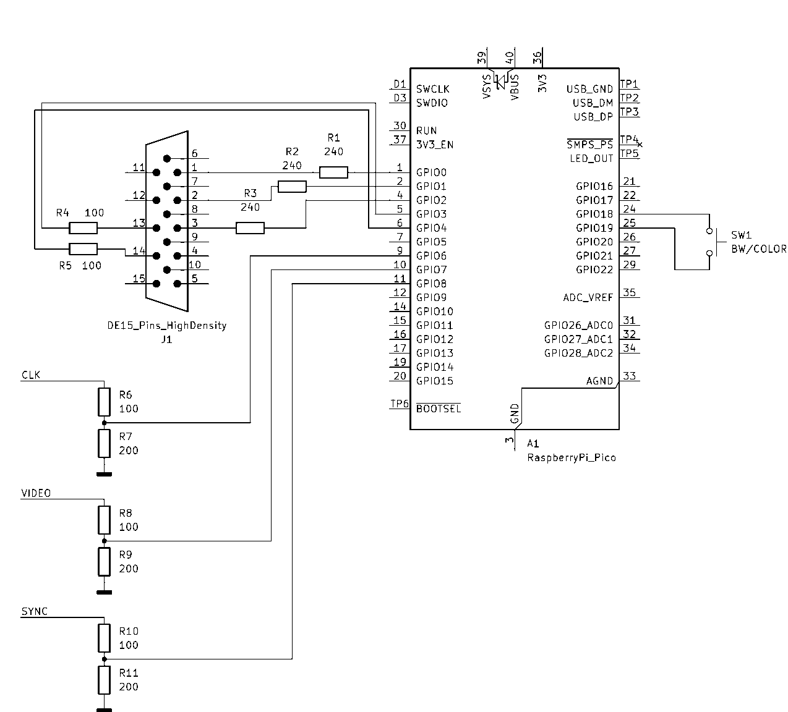

# bktovga
Мод для подключения БК0010-01 к VGA монитору. Используется raspberi pi pico (rp2040).
Схема подключения:

Сигнал CLK берется с тактового генератора БК0010-01, вывод 1 микросхемы D8.
Сигналы VIDEO и SYNC берутся с выводов 9 и 12 микросхемы D21 соответственно.

#Баги и недороботки
1. Самая первая строка изображения отображается со здвигом, установить причину пока не удалось.
2. Кнопка переключения режимов (чб/цвет) иногда срабатывает и при отпускинии, легко исправить, когда нибудь сделаю.

